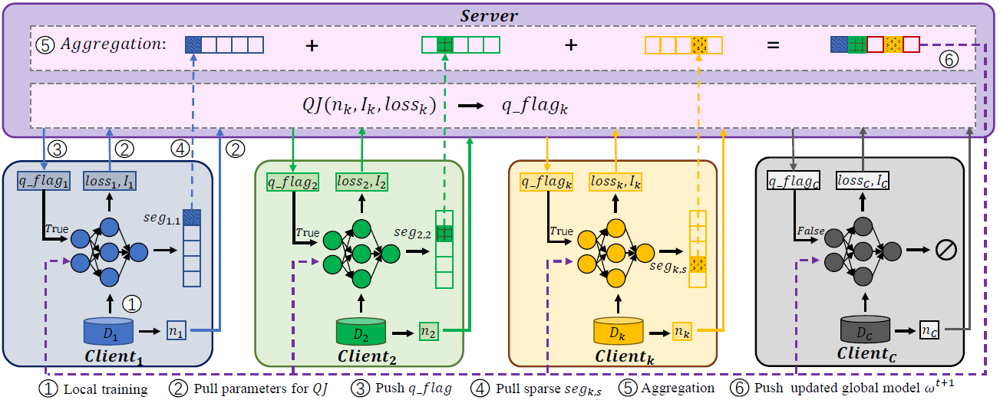

## QSFL: A Two-Level Uplink Communication Optimization Framework for Federated Learning
This is an official implementation of ***QSFL: A Two-Level Uplink Communication Optimization Framework for Federated Learning*** paper. [[Link is comming soon...]]()



#### Installation
- Create a virtual environment with virtualenv
- Clone the repo
- Run: ```cd <PATH_TO_THE_CLONED_REPO>```
- Run: ```pip install -r requirements.txt``` to install necessary packages.

---------

#### Reproduce Paper Results
- Server executes script: ```run_server.sh ```
- Clients execute script: ```run.sh```
- Stop all threads and end FL workflow: ```stop.sh```
---------


#### Citation

If you find QSFL to be useful in your own research, please consider citing the following bibtex:

```bib
@inproceedings{QSFL,
  author    = {Liping Yi and
               Wang Gang and
               Xiaoguang Liu},
  title     = {{QSFL:} {A} Two-Level Uplink Communication Optimization Framework
               for Federated Learning},
  booktitle = {International Conference on Machine Learning, {ICML} 2022, 17-23 July
               2022, Baltimore, Maryland, {USA}},
  series    = {Proceedings of Machine Learning Research},
  volume    = {162},
  pages     = {25501--25513},
  publisher = {{PMLR}},
  year      = {2022},
}
```
